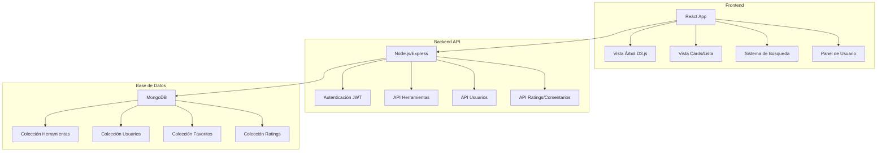
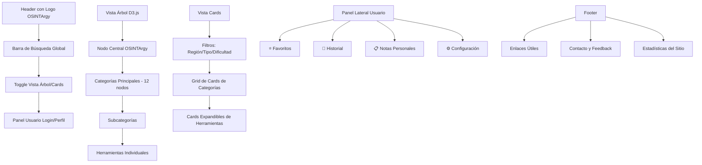

# Plan Arquitectónico Completo para OSINTArgy

## 📋 Resumen Ejecutivo

OSINTArgy será una versión mejorada y localizada de osintframework.com, con interfaz dual (árbol D3.js + vista cards), contenido en español argentino, herramientas locales de Argentina/LATAM, y sistema completo de usuario con backend.

### Características Principales
- **Interfaz Dual**: Vista árbol interactivo D3.js + Vista cards moderna
- **Localización**: 100% en español argentino
- **Contenido Expandido**: +500 herramientas (vs ~300 del original)
- **Herramientas Locales**: Sección específica Argentina/LATAM
- **Sistema de Usuario**: Favoritos, historial, notas y ratings
- **Backend Completo**: API REST con autenticación y base de datos

## 🏗️ Arquitectura del Sistema



## 📁 Estructura de Archivos del Proyecto

```
OSINTArgy/
├── frontend/
│   ├── public/
│   │   ├── index.html
│   │   ├── favicon.ico
│   │   └── manifest.json
│   ├── src/
│   │   ├── components/
│   │   │   ├── Header/
│   │   │   │   ├── Header.jsx
│   │   │   │   └── Header.css
│   │   │   ├── TreeView/
│   │   │   │   ├── TreeView.jsx
│   │   │   │   ├── TreeView.css
│   │   │   │   └── d3-tree.js
│   │   │   ├── CardsView/
│   │   │   │   ├── CardsView.jsx
│   │   │   │   ├── CategoryCard.jsx
│   │   │   │   ├── ToolCard.jsx
│   │   │   │   └── CardsView.css
│   │   │   ├── SearchBar/
│   │   │   │   ├── SearchBar.jsx
│   │   │   │   └── SearchBar.css
│   │   │   ├── UserPanel/
│   │   │   │   ├── UserPanel.jsx
│   │   │   │   ├── Favorites.jsx
│   │   │   │   ├── History.jsx
│   │   │   │   ├── Notes.jsx
│   │   │   │   └── UserPanel.css
│   │   │   ├── Auth/
│   │   │   │   ├── Login.jsx
│   │   │   │   ├── Register.jsx
│   │   │   │   └── Auth.css
│   │   │   └── Common/
│   │   │       ├── Modal.jsx
│   │   │       ├── Loading.jsx
│   │   │       └── Common.css
│   │   ├── hooks/
│   │   │   ├── useAuth.js
│   │   │   ├── useTools.js
│   │   │   └── useLocalStorage.js
│   │   ├── services/
│   │   │   ├── api.js
│   │   │   ├── authService.js
│   │   │   └── toolsService.js
│   │   ├── utils/
│   │   │   ├── constants.js
│   │   │   └── helpers.js
│   │   ├── data/
│   │   │   ├── tools.json
│   │   │   └── categories.json
│   │   ├── styles/
│   │   │   ├── globals.css
│   │   │   ├── variables.css
│   │   │   └── themes.css
│   │   ├── App.jsx
│   │   ├── App.css
│   │   └── index.js
│   ├── package.json
│   └── package-lock.json
├── backend/
│   ├── src/
│   │   ├── controllers/
│   │   │   ├── authController.js
│   │   │   ├── toolsController.js
│   │   │   ├── userController.js
│   │   │   └── ratingsController.js
│   │   ├── models/
│   │   │   ├── User.js
│   │   │   ├── Tool.js
│   │   │   ├── Category.js
│   │   │   ├── Favorite.js
│   │   │   └── Rating.js
│   │   ├── routes/
│   │   │   ├── auth.js
│   │   │   ├── tools.js
│   │   │   ├── users.js
│   │   │   └── ratings.js
│   │   ├── middleware/
│   │   │   ├── auth.js
│   │   │   ├── validation.js
│   │   │   └── errorHandler.js
│   │   ├── config/
│   │   │   ├── database.js
│   │   │   └── config.js
│   │   ├── utils/
│   │   │   └── helpers.js
│   │   └── app.js
│   ├── package.json
│   └── package-lock.json
├── docs/
│   ├── API.md
│   ├── DEPLOYMENT.md
│   └── USER_GUIDE.md
├── scripts/
│   ├── seed-database.js
│   └── deploy.sh
├── README.md
└── docker-compose.yml
```

## 🗂️ Estructura de Datos JSON

### Esquema de Categorías
```json
{
  "categories": [
    {
      "id": "buscadores-generales",
      "name": "Buscadores Generales y Avanzados",
      "description": "Motores de búsqueda especializados y técnicas avanzadas de búsqueda",
      "icon": "search",
      "color": "#4CAF50",
      "subcategories": [
        {
          "id": "motores-busqueda",
          "name": "Motores de Búsqueda",
          "tools": ["google-advanced", "bing-advanced", "yandex", "baidu"]
        },
        {
          "id": "metabuscadores",
          "name": "Metabuscadores",
          "tools": ["searx", "startpage", "duckduckgo"]
        }
      ]
    },
    {
      "id": "redes-sociales",
      "name": "Redes Sociales y Perfiles",
      "description": "Herramientas para investigar perfiles y actividad en redes sociales",
      "icon": "users",
      "color": "#2196F3",
      "subcategories": [
        {
          "id": "plataformas-principales",
          "name": "Plataformas Principales",
          "tools": ["facebook-search", "twitter-advanced", "instagram-tools"]
        }
      ]
    },
    {
      "id": "argentina-latam",
      "name": "🇦🇷 Argentina / LATAM",
      "description": "Herramientas específicas para Argentina y Latinoamérica",
      "icon": "flag",
      "color": "#FF9800",
      "subcategories": [
        {
          "id": "registros-publicos-ar",
          "name": "Registros Públicos Argentina",
          "tools": ["afip-cuit", "anses-cuil", "registro-personas"]
        },
        {
          "id": "medios-comunicacion-ar",
          "name": "Medios de Comunicación",
          "tools": ["clarin", "lanacion", "pagina12", "infobae"]
        }
      ]
    }
  ]
}
```

### Esquema de Herramientas
```json
{
  "tools": [
    {
      "id": "google-advanced",
      "name": "Google Búsqueda Avanzada",
      "description": "Motor de búsqueda más utilizado del mundo con operadores avanzados.",
      "utility": "Permite búsquedas precisas usando operadores como site:, filetype:, intitle:, etc.",
      "url": "https://www.google.com/advanced_search",
      "category": "buscadores-generales",
      "subcategory": "motores-busqueda",
      "tags": ["búsqueda", "google", "operadores"],
      "type": "web",
      "indicators": ["D"],
      "region": "internacional",
      "language": "es",
      "rating": 4.8,
      "usage_count": 15420,
      "last_updated": "2025-06-19",
      "status": "active",
      "requires_registration": false,
      "is_free": true,
      "difficulty_level": "beginner"
    },
    {
      "id": "afip-cuit",
      "name": "AFIP - Consulta CUIT",
      "description": "Consulta oficial de CUIT/CUIL en la base de datos de AFIP.",
      "utility": "Verifica la validez y obtiene datos básicos de contribuyentes argentinos.",
      "url": "https://www.afip.gob.ar/sitio/externos/default.asp",
      "category": "argentina-latam",
      "subcategory": "registros-publicos-ar",
      "tags": ["cuit", "afip", "argentina", "contribuyentes"],
      "type": "web",
      "indicators": ["R"],
      "region": "argentina",
      "language": "es",
      "rating": 4.5,
      "usage_count": 8920,
      "last_updated": "2025-06-19",
      "status": "active",
      "requires_registration": true,
      "is_free": true,
      "difficulty_level": "beginner"
    }
  ]
}
```

## 🎨 Diseño Visual y UX

### Esquema de Colores
```css
:root {
  /* Colores Primarios */
  --primary-blue: #1976D2;
  --primary-light: #42A5F5;
  --primary-dark: #0D47A1;
  
  /* Colores Secundarios */
  --secondary-teal: #00ACC1;
  --secondary-light: #4DD0E1;
  --secondary-dark: #006064;
  
  /* Colores de Acento */
  --accent-orange: #FF9800;
  --accent-green: #4CAF50;
  --accent-red: #F44336;
  --accent-purple: #9C27B0;
  
  /* Colores Neutros */
  --white: #FFFFFF;
  --gray-50: #FAFAFA;
  --gray-100: #F5F5F5;
  --gray-200: #EEEEEE;
  --gray-300: #E0E0E0;
  --gray-400: #BDBDBD;
  --gray-500: #9E9E9E;
  --gray-600: #757575;
  --gray-700: #616161;
  --gray-800: #424242;
  --gray-900: #212121;
  --black: #000000;
  
  /* Colores por Categoría */
  --cat-buscadores: #4CAF50;
  --cat-redes-sociales: #2196F3;
  --cat-email: #FF5722;
  --cat-dominios: #9C27B0;
  --cat-geolocalizacion: #FF9800;
  --cat-imagenes: #E91E63;
  --cat-documentos: #795548;
  --cat-registros: #607D8B;
  --cat-darkweb: #424242;
  --cat-analisis: #00BCD4;
  --cat-utilidades: #8BC34A;
  --cat-argentina: #FF9800;
}
```

### Wireframe de Interfaz



### Responsive Design
- **Desktop**: Layout completo con panel lateral
- **Tablet**: Layout adaptado, panel lateral colapsable
- **Mobile**: Vista stack, navegación por tabs

## 🔧 Stack Tecnológico

### Frontend
- **Framework**: React 18 con Hooks y Context API
- **Visualización**: D3.js v7 para vista árbol interactivo
- **Estilos**: CSS Modules + CSS Variables para theming
- **Estado Global**: Context API + useReducer
- **HTTP Client**: Axios con interceptors
- **Routing**: React Router v6
- **Build Tool**: Vite para desarrollo rápido
- **Testing**: Jest + React Testing Library
- **Linting**: ESLint + Prettier

### Backend
- **Runtime**: Node.js 18+ LTS
- **Framework**: Express.js con middleware personalizado
- **Base de Datos**: MongoDB con Mongoose ODM
- **Autenticación**: JWT + bcrypt para hashing
- **Validación**: Joi para validación de schemas
- **Documentación API**: Swagger/OpenAPI 3.0
- **Testing**: Jest + Supertest
- **Logging**: Winston con rotación de logs
- **Rate Limiting**: express-rate-limit

### DevOps y Deployment
- **Containerización**: Docker + Docker Compose
- **CI/CD**: GitHub Actions
- **Frontend Hosting**: Vercel con CDN global
- **Backend Hosting**: Railway con auto-scaling
- **Base de Datos**: MongoDB Atlas
- **Monitoreo**: Sentry para error tracking
- **Analytics**: Google Analytics 4

## 📊 Categorías Expandidas de OSINTArgy

### 1. **Buscadores Generales y Avanzados** 🔍
**Descripción**: Motores de búsqueda especializados y técnicas avanzadas
- **Motores de Búsqueda**: Google Advanced, Bing, Yandex, Baidu, Searx
- **Metabuscadores**: StartPage, DuckDuckGo, Searx instances
- **Búsquedas Especializadas**: Shodan, Censys, ZoomEye
- **Operadores Avanzados**: Google Dorks, Bing Dorks

### 2. **Redes Sociales y Perfiles** 👥
**Descripción**: Investigación de perfiles y actividad en plataformas sociales
- **Plataformas Principales**: Facebook, Twitter/X, Instagram, LinkedIn
- **Plataformas Emergentes**: TikTok, Discord, Telegram
- **Herramientas de Análisis**: Social Searcher, Mention, Brand24
- **Verificación de Perfiles**: Sherlock, WhatsMyName

### 3. **Correo Electrónico** 📧
**Descripción**: Verificación y análisis de direcciones de correo
- **Verificación**: Hunter, VoilaNorbert, FindThatLead
- **Análisis de Headers**: MXToolbox, Mail Header Analyzer
- **Búsqueda de Breaches**: HaveIBeenPwned, DeHashed

### 4. **Dominios e IPs** 🌐
**Descripción**: Información de infraestructura web y redes
- **Información de Dominios**: Whois, DomainTools, SecurityTrails
- **Análisis de IPs**: IPinfo, MaxMind, AbuseIPDB
- **DNS**: DNSdumpster, ViewDNS, MXToolbox
- **Certificados SSL**: crt.sh, Certificate Transparency

### 5. **Geolocalización y Mapas** 🗺️
**Descripción**: Herramientas de ubicación y análisis geoespacial
- **Mapas Satelitales**: Google Earth, Bing Maps, Yandex Maps
- **Coordenadas**: What3Words, Plus Codes
- **Análisis Geoespacial**: QGIS, OpenStreetMap
- **Cámaras en Vivo**: EarthCam, Insecam

### 6. **Imágenes y Videos** 📸
**Descripción**: Análisis y búsqueda inversa de contenido multimedia
- **Búsqueda Inversa**: Google Images, TinEye, Yandex Images
- **Análisis de Metadatos**: ExifTool, Jeffrey's Exif Viewer
- **Verificación**: InVID, RevEye
- **Reconocimiento Facial**: PimEyes, FindClone

### 7. **Documentos y Metadatos** 📄
**Descripción**: Análisis de documentos y extracción de información
- **Análisis de PDFs**: PDF Parser, Didier Stevens Tools
- **Metadatos**: ExifTool, FOCA
- **Búsqueda de Documentos**: Google Filetype, DocumentCloud

### 8. **Registros Públicos y Financieros** 🏛️
**Descripción**: Bases de datos gubernamentales y registros oficiales
- **Registros Comerciales**: OpenCorporates, Orbis
- **Registros de Propiedad**: Zillow, Realtor
- **Cortes y Legal**: PACER, CourtListener

### 9. **Dark Web y Amenazas** 🕵️
**Descripción**: Monitoreo de amenazas y inteligencia de ciberseguridad
- **Motores Dark Web**: Ahmia, DuckDuckGo Onion
- **Threat Intelligence**: VirusTotal, Hybrid Analysis
- **Breach Monitoring**: HaveIBeenPwned, Intelligence X

### 10. **Herramientas de Análisis y Visualización** 📊
**Descripción**: Análisis de datos y visualización de información
- **Visualización**: Maltego, Gephi, Cytoscape
- **Análisis de Redes**: NetworkX, Palantir Gotham
- **Timeline**: TimelineJS, Tiki-Toki

### 11. **Utilidades y Varios** 🛠️
**Descripción**: Herramientas auxiliares y utilidades diversas
- **Codificación/Decodificación**: CyberChef, Base64 Decode
- **Generadores**: Fake Name Generator, Random User
- **Utilidades de Red**: Nmap, Masscan

### 12. **🇦🇷 Argentina / LATAM** (Categoría Especial)
**Descripción**: Herramientas específicas para Argentina y Latinoamérica
- **Registros Públicos Argentina**: AFIP, ANSES, Registro de Personas
- **Medios de Comunicación**: Clarín, La Nación, Página/12
- **Bases de Datos Gubernamentales**: Boletín Oficial, INFOLEG
- **Herramientas LATAM**: Recursos regionales

### 13. **Teléfonos y Comunicaciones** 📞
**Descripción**: Herramientas para investigar números de teléfono, buscar información de contacto y analizar comunicaciones
- **Búsqueda Inversa y Directa**: Herramientas para búsqueda directa e inversa de números telefónicos
- **Análisis de Portadora y CNAM**: Análisis de operadora y información de identificación de llamadas
- **Directorios Públicos**: Directorios telefónicos y páginas amarillas
- **APIs y Herramientas de Desarrollo**: APIs y herramientas para desarrolladores

### 14. **Archivos y Documentos** 📁
**Descripción**: Archivos web históricos, bases de datos y documentos filtrados
- **Archivos Web**: Wayback Machine, Archive.is, versiones históricas
- **Archivos Históricos**: Documentos y archivos históricos
- **Archivos Regionales**: Archivos específicos por región
- **Bibliotecas Digitales**: Anna's Archive, libros y documentos académicos
- **Documentos Filtrados**: WikiLeaks, Cryptome, documentos clasificados
- **Datasets de Investigación**: Datasets académicos y de investigación

### 15. **Criptomonedas y Blockchain** ₿
**Descripción**: Análisis de transacciones, exploradores de blockchain y herramientas forenses
- **Exploradores Bitcoin**: Blockchain.info, OXT, análisis de transacciones Bitcoin
- **Exploradores Ethereum**: Etherscan, análisis de contratos inteligentes
- **Exploradores Monero**: XMRChain, análisis de transacciones privadas
- **Análisis Forense**: GraphSense, análisis avanzado de blockchain
- **Identificación de Wallets**: Wallet Explorer, identificación de direcciones
- **Seguridad y Fraudes**: Bitcoin Who's Who, detección de estafas

## 🚀 Plan de Implementación Técnica

### Fase 1: Fundación y Setup (Semanas 1-2)
**Objetivos**: Establecer la base técnica del proyecto
- ✅ Configuración del entorno de desarrollo
- ✅ Setup de repositorio Git con GitFlow
- ✅ Configuración de Docker y Docker Compose
- ✅ Setup inicial de React + Vite
- ✅ Configuración de Express.js + MongoDB
- ✅ Sistema de autenticación JWT básico
- ✅ CI/CD pipeline con GitHub Actions

**Entregables**:
- Repositorio configurado
- Entorno de desarrollo funcional
- Pipeline de CI/CD básico

### Fase 2: Core Features (Semanas 3-4)
**Objetivos**: Implementar funcionalidades principales
- 🔄 Implementación de vista árbol D3.js
- 🔄 Sistema de categorías y herramientas
- 🔄 API REST completa (CRUD herramientas)
- 🔄 Vista cards responsive
- 🔄 Sistema de búsqueda básico
- 🔄 Navegación entre vistas

**Entregables**:
- Vista árbol funcional
- Vista cards implementada
- API REST operativa
- Sistema de navegación

### Fase 3: Funcionalidades Avanzadas (Semanas 5-6)
**Objetivos**: Agregar características de usuario avanzadas
- 🔄 Sistema de favoritos con persistencia
- 🔄 Historial de navegación
- 🔄 Sistema de notas personales
- 🔄 Sistema de rating y comentarios
- 🔄 Panel de usuario completo
- 🔄 Búsqueda avanzada con filtros

**Entregables**:
- Panel de usuario funcional
- Sistema de favoritos y notas
- Búsqueda avanzada
- Sistema de ratings

### Fase 4: Contenido y Localización (Semanas 7-8)
**Objetivos**: Poblar la base de datos y localizar contenido
- 🔄 Población de base de datos con 500+ herramientas
- 🔄 Traducción completa al español argentino
- 🔄 Implementación de herramientas Argentina/LATAM
- 🔄 Validación y testing de contenido
- 🔄 Optimización de performance
- 🔄 Testing de usabilidad

**Entregables**:
- Base de datos poblada
- Contenido 100% en español
- Herramientas locales implementadas
- Performance optimizada

### Fase 5: Deploy y Optimización (Semanas 9-10)
**Objetivos**: Preparar para producción y optimizar
- 🔄 Configuración de producción
- 🔄 Deploy en Vercel (frontend) y Railway (backend)
- 🔄 Configuración de MongoDB Atlas
- 🔄 Implementación de monitoreo (Sentry)
- 🔄 SEO y accesibilidad
- 🔄 Documentación final
- 🔄 Testing de carga y stress

**Entregables**:
- Aplicación en producción
- Monitoreo configurado
- Documentación completa
- Performance optimizada

## 📈 Métricas y KPIs

### Performance
- **Tiempo de carga inicial**: < 3 segundos
- **First Contentful Paint**: < 1.5 segundos
- **Largest Contentful Paint**: < 2.5 segundos
- **Cumulative Layout Shift**: < 0.1
- **Time to Interactive**: < 3.5 segundos

### Usabilidad
- **Tasa de rebote**: < 40%
- **Tiempo promedio en sitio**: > 5 minutos
- **Páginas por sesión**: > 3
- **Tasa de conversión a registro**: > 15%

### Contenido
- **Total de herramientas**: > 500 (vs ~300 del original)
- **Herramientas Argentina/LATAM**: > 100
- **Categorías principales**: 12
- **Subcategorías**: > 50
- **Cobertura de idioma**: 100% español argentino

### Engagement
- **Usuarios registrados**: Meta 1000 en primer mes
- **Herramientas favoritas promedio**: > 10 por usuario
- **Notas creadas**: > 5 por usuario activo
- **Ratings promedio**: > 100 por herramienta popular

### Técnicas
- **Uptime**: > 99.5%
- **Error rate**: < 1%
- **API response time**: < 500ms
- **Database query time**: < 100ms

## 🔒 Consideraciones de Seguridad

### Frontend
- Sanitización de inputs
- Validación client-side
- HTTPS obligatorio
- Content Security Policy

### Backend
- Validación server-side con Joi
- Rate limiting por IP
- JWT con expiración
- Bcrypt para passwords
- Helmet.js para headers de seguridad

### Base de Datos
- Conexión encriptada
- Índices optimizados
- Backup automático
- Acceso restringido por IP

## 📱 Responsive Design

### Breakpoints
```css
/* Mobile First Approach */
:root {
  --mobile: 320px;
  --tablet: 768px;
  --desktop: 1024px;
  --large: 1440px;
}

@media (min-width: 768px) { /* Tablet */ }
@media (min-width: 1024px) { /* Desktop */ }
@media (min-width: 1440px) { /* Large Desktop */ }
```

### Adaptaciones por Dispositivo
- **Mobile (320-767px)**: Vista stack, navegación por tabs
- **Tablet (768-1023px)**: Layout híbrido, panel colapsable
- **Desktop (1024px+)**: Layout completo con sidebar

## 🌐 SEO y Accesibilidad

### SEO
- Meta tags optimizados
- Schema.org markup
- Sitemap XML
- URLs semánticas
- Open Graph tags

### Accesibilidad (WCAG 2.1 AA)
- Contraste de colores adecuado
- Navegación por teclado
- Screen reader compatible
- Alt text en imágenes
- ARIA labels

## 📚 Documentación

### Para Desarrolladores
- **README.md**: Guía de inicio rápido
- **API.md**: Documentación completa de API
- **CONTRIBUTING.md**: Guía de contribución
- **DEPLOYMENT.md**: Guía de despliegue

### Para Usuarios
- **USER_GUIDE.md**: Manual de usuario
- **FAQ.md**: Preguntas frecuentes
- **CHANGELOG.md**: Registro de cambios

## 🔄 Mantenimiento y Actualizaciones

### Actualizaciones de Contenido
- Revisión mensual de herramientas
- Validación de enlaces rotos
- Agregado de nuevas herramientas
- Actualización de descripciones

### Actualizaciones Técnicas
- Dependencias de seguridad: Semanal
- Dependencias menores: Mensual
- Dependencias mayores: Trimestral
- Backup de base de datos: Diario

## 🎯 Roadmap Futuro

### Versión 2.0 (6 meses)
- API pública para desarrolladores
- Plugin para navegadores
- Aplicación móvil nativa
- Integración con herramientas OSINT

### Versión 3.0 (12 meses)
- IA para recomendación de herramientas
- Workflows automatizados
- Colaboración entre usuarios
- Marketplace de herramientas

---

## 📞 Contacto y Soporte

- **Repositorio**: GitHub.com/OSINTArgy
- **Email**: contacto@osintargy.com
- **Twitter**: @OSINTArgy
- **Discord**: Comunidad OSINTArgy

---

